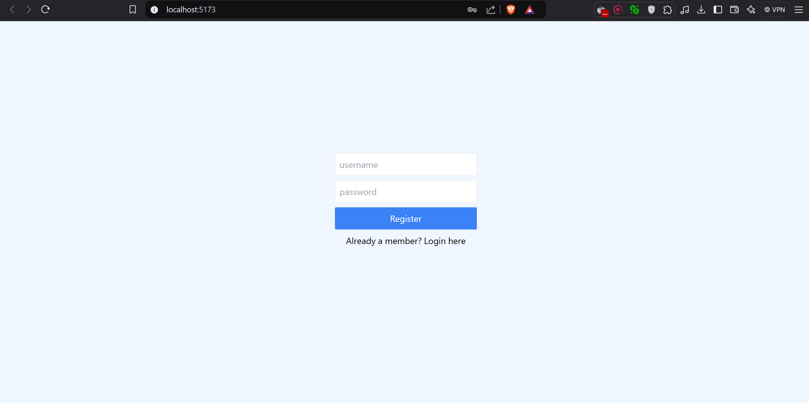
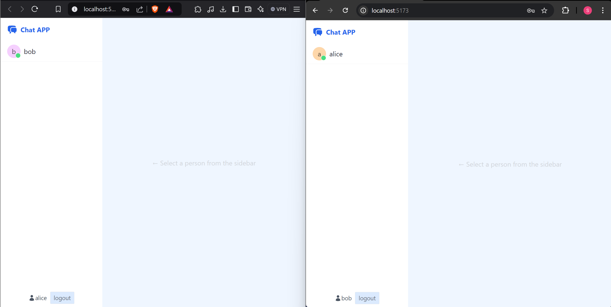
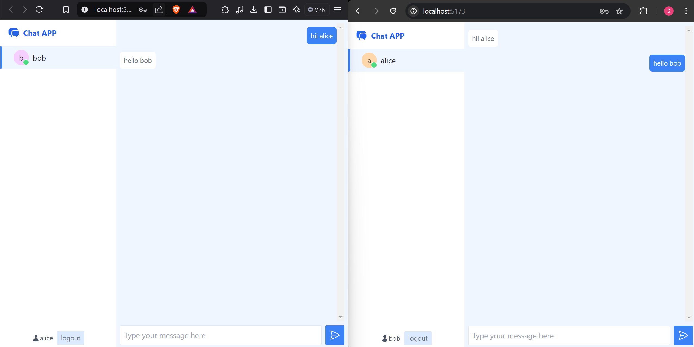

Certainly! Including screenshots in your README can greatly enhance the user experience by providing visual references. Below is the updated README content with placeholders for screenshots. You can replace the placeholders with the actual paths to your images once you have them.

---

# Real-time Chat Application

A full-stack real-time chat application built with Node.js, Express, MongoDB, React, and WebSockets. This application allows users to register, log in, and chat with other online users in real-time.

## Table of Contents

- [Real-time Chat Application](#real-time-chat-application)
  - [Table of Contents](#table-of-contents)
  - [Features](#features)
  - [Screenshots](#screenshots)
    - [Login and Registration Page](#login-and-registration-page)
    - [Chat Interface](#chat-interface)
    - [Messaging](#messaging)
  - [Technologies Used](#technologies-used)
    - [Backend](#backend)
    - [Frontend](#frontend)
  - [Prerequisites](#prerequisites)
  - [Installation](#installation)
    - [Backend Setup](#backend-setup)
    - [Frontend Setup](#frontend-setup)
  - [Usage](#usage)
  - [Project Structure](#project-structure)
  - [Key Components](#key-components)
  - [Contributing](#contributing)
  - [License](#license)

## Features

- User registration and authentication
- Real-time messaging with WebSockets
- Display of online and offline users
- Responsive design using Tailwind CSS
- Secure password hashing with bcrypt
- JWT-based authentication
- Persistent message history stored in MongoDB

## Screenshots

### Login and Registration Page



### Chat Interface



### Messaging



## Technologies Used

### Backend

- Node.js
- Express.js
- MongoDB
- Mongoose
- WebSocket
- JSON Web Tokens (JWT)
- bcrypt.js
- dotenv

### Frontend

- React.js
- Vite
- Tailwind CSS
- Axios
- Lodash

## Prerequisites

- Node.js (v14 or higher)
- npm or Yarn
- MongoDB (running instance)
- Git (for cloning the repository)

## Installation

### Backend Setup

1. **Clone the Repository**

   ```bash
   git clone https://github.com/yourusername/your-repo-name.git
   cd your-repo-name/api
   ```

2. **Install Dependencies**

   Using Yarn:

   ```bash
   yarn install
   ```

   Or using npm:

   ```bash
   npm install
   ```

3. **Configure Environment Variables**

   Create a `.env` file in the `api` directory with the following content:

   ```env
   MONGO_URL=your_mongodb_connection_string
   JWT_SECRET=your_jwt_secret_key
   CLIENT_URL=http://localhost:5173
   ```

   - Replace `your_mongodb_connection_string` with your MongoDB connection string.
   - Replace `your_jwt_secret_key` with a secure secret key.

4. **Start the Backend Server**

   ```bash
   yarn start
   ```

   The backend server will start on `http://localhost:4040`.

### Frontend Setup

1. **Navigate to the Client Directory**

   ```bash
   cd ../client
   ```

2. **Install Dependencies**

   Using Yarn:

   ```bash
   yarn install
   ```

   Or using npm:

   ```bash
   npm install
   ```

3. **Start the Frontend Development Server**

   ```bash
   yarn dev
   ```

   The frontend will start on `http://localhost:5173`.

## Usage

1. Open your browser and navigate to `http://localhost:5173`.
2. Register a new user account.
3. Log in with your credentials.
4. You will see a list of online users on the sidebar.
5. Click on a user to start chatting in real-time.

## Project Structure

```
project-root/
├── api/
│   ├── models/
│   │   ├── Message.js
│   │   └── User.js
│   ├── .env
│   ├── index.js
│   ├── package.json
│   └── yarn.lock
├── client/
│   ├── public/
│   ├── src/
│   │   ├── App.jsx
│   │   ├── Avatar.jsx
│   │   ├── Chat.jsx
│   │   ├── Contact.jsx
│   │   ├── Logo.jsx
│   │   ├── Main.jsx
│   │   ├── RegisterAndLoginForm.jsx
│   │   ├── Routes.jsx
│   │   └── UserContext.jsx
│   ├── .gitignore
│   ├── index.html
│   ├── package.json
│   ├── postcss.config.cjs
│   ├── tailwind.config.cjs
│   ├── vite.config.js
│   └── yarn.lock
├── .gitignore
└── README.md
```

## Key Components

- **Backend (`api` directory)**

  - `index.js`: Main server file that sets up Express, WebSocket server, and handles routes.
  - `models/User.js`: Mongoose model for user data.
  - `models/Message.js`: Mongoose model for message data.

- **Frontend (`client` directory)**
  - `src/App.jsx`: Root component that sets up Axios defaults and wraps the app with `UserContextProvider`.
  - `src/Routes.jsx`: Handles routing based on user authentication state.
  - `src/UserContext.jsx`: Context provider for managing user state across the application.
  - `src/RegisterAndLoginForm.jsx`: Component for user registration and login.
  - `src/Chat.jsx`: Main chat component that handles real-time messaging.

## Contributing

Contributions are welcome! Please follow these steps:

1. Fork the repository.
2. Create a new branch:

   ```bash
   git checkout -b feature/your-feature-name
   ```

3. Make your changes and commit them:

   ```bash
   git commit -m "Add your message here"
   ```

4. Push to the branch:

   ```bash
   git push origin feature/your-feature-name
   ```

5. Open a pull request.

## License

This project is licensed under the [MIT License](LICENSE).

---
